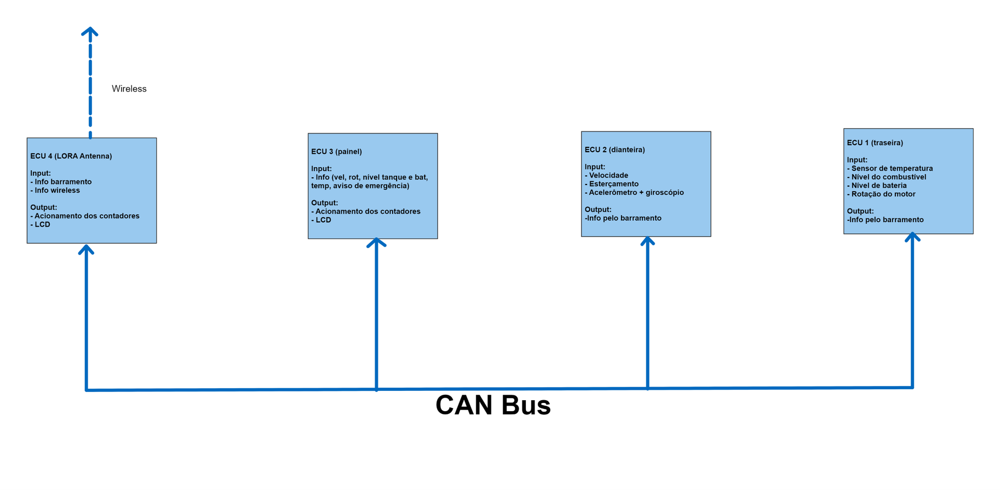

## **FoxBaja Eletronica FX4.0**

Este repositório contém o código e toda a documentação necessária para o desenvolvimento do subsistema de **eletrônica** do carro da equipe Insper Fox Baja, em sua versão FX4.0. Nesta versão, o carro irá receber tração nas 4 rodas e um novo sistema de telemetria, baseado em barramento CAN (Controller Area Network).

---

## Visão Geral

O barramento CAN é um protocolo de comunicação serial assíncrono de dois fios, usualmente utilizado em meios **automobilísticos**, dado sua notória robustez, além de outras vantagens de performance.

Para este projeto, o barramento CAN será utilizado para a comunicação entre as diversas ECU's (Electronic Control Unit) do carro, que serão responsáveis por controlar os diversos sistemas do carro, como a comunicação externa, a telemetria, o painel, etc. Com isso, a equipe organizou o projeto em 4 ECU's, sendo elas:

- ECU de sensores traseiros
- ECU de sensores dianteiros
- ECU do painel
- ECU de comunicação externa

Sua organização pode ser vista na imagem abaixo:

## Estrutura dos códigos das ECUs

Todas as ECUs possuem a mesma base estrutural de código, obtida através dos exemplos do [repositório da própria Espressif](https://github.com/espressif/esp-idf/tree/03d4fa28694ee15ccfd5a97447575de2d1655026).

Os códigos estão todos organizados em tasks, que são executadas em paralelo, e se comunicam através de filas e semáforos, que são estruturas de dados que permitem a comunicação entre as tasks. Para a implementação das tasks, foi utilizado o **freeRTOS**, que é um sistema operacional de tempo real, que permite a execução de múltiplas tasks em paralelo.

Foram implementadas tasks diferentes para cada funcionalidade do código, sendo elas:

- recebimento de mensagens (twai_receive_task)
- envio de mensagens (twai_transmit_task)
- controle do fluxo do código (twai_control_task)

Para o controle do fluxo do código, foi implementa uma **máquina de estados**, que é basicamente um modelo de controle de programas de computadores, que alterna entre um número finito de estados, conforme o andar do código. Cada estado é responsável por executar uma tarefa específica. A partir disso, conforme as tarefas vão executando o programa vai fluindo entre estados a partir das respostas do próprio programa.

Para sua implementação, foi utilizada a estrutura `enum`. Ela consiste em um tipo de dado que possui uma quantidade pré determinada de valores, que são também pré definidos pelo programador. Estes valores, no caso deste projeto, representam os estados da máquina de estados.
